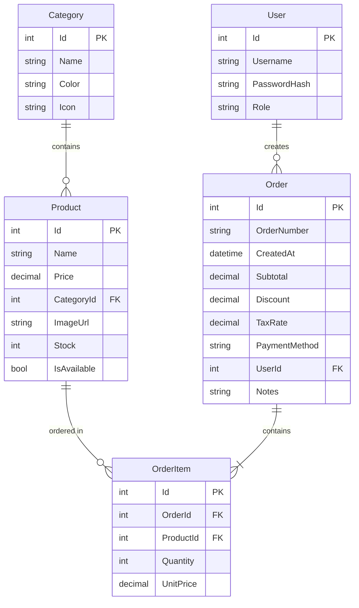

<p align="center">
  
</p>

<h1 align="center">🧾 KasserPro - نظام نقاط البيع</h1>

<p align="center">
  <strong>نظام كاشير متكامل وحديث للمحلات والمطاعم والكافيهات</strong>
</p>

<p align="center">
  
  
  
  
  
</p>

<p align="center">
  
  
  
</p>

---

## 📋 نظرة عامة

**KasserPro** هو نظام نقاط بيع (POS) عصري ومتكامل، مصمم خصيصاً للسوق العربي. يتميز بواجهة مستخدم أنيقة وسهلة الاستخدام، مع دعم كامل للغة العربية واتجاه RTL.

### ✨ لماذا KasserPro؟

| الميزة | الوصف |
|--------|-------|
| 🎨 **واجهة عصرية** | تصميم Dark Mode أنيق ومريح للعين |
| 🌍 **دعم العربية** | واجهة عربية كاملة مع اتجاه RTL |
| ⚡ **سريع وخفيف** | بناء على أحدث التقنيات لأداء فائق |
| 📱 **متجاوب** | يعمل على جميع الشاشات والأجهزة |
| 🔒 **آمن** | حماية البيانات وإدارة الصلاحيات |
| 🛠️ **قابل للتخصيص** | إعدادات مرنة تناسب احتياجاتك |

---

## 🚀 المميزات الرئيسية

### 💳 نقطة البيع (POS)
- ✅ واجهة بيع سريعة وسهلة الاستخدام
- ✅ عرض المنتجات بشكل مرئي جذاب
- ✅ فلترة المنتجات حسب التصنيف
- ✅ بحث سريع في المنتجات
- ✅ سلة مشتريات ذكية
- ✅ حساب تلقائي للضريبة (VAT)
- ✅ دعم الخصومات
- ✅ طرق دفع متعددة (كاش - بطاقة - محفظة)
- ✅ طباعة الفواتير

### 📦 إدارة المنتجات
- ✅ إضافة وتعديل وحذف المنتجات
- ✅ تصنيف المنتجات في فئات
- ✅ إدارة المخزون والكميات
- ✅ تحديد حالة توفر المنتج
- ✅ إضافة صور للمنتجات

### 🏷️ إدارة التصنيفات
- ✅ تنظيم المنتجات في فئات
- ✅ تخصيص ألوان وأيقونات للتصنيفات
- ✅ سهولة التنقل بين الفئات

### 📋 إدارة الطلبات
- ✅ عرض سجل الطلبات الكامل
- ✅ تفاصيل كل طلب
- ✅ فلترة الطلبات حسب التاريخ
- ✅ أرقام طلبات فريدة
- ✅ حفظ ملاحظات على الطلبات

### ⚙️ الإعدادات
- ✅ تفعيل/تعطيل الضريبة
- ✅ تحديد نسبة الضريبة
- ✅ إعدادات عامة للنظام

---

## 🏗️ البنية التقنية

```
KasserProFrontEnd/
├── 📁 KasserPro/                    # Backend - ASP.NET Core 8
│   ├── 📁 Controllers/              # API Controllers
│   │   ├── CategoriesController.cs
│   │   ├── OrdersController.cs
│   │   ├── ProductsController.cs
│   │   └── SettingsController.cs
│   ├── 📁 Models/                   # Data Models
│   │   ├── Product.cs
│   │   ├── Category.cs
│   │   ├── Order.cs
│   │   ├── OrderItem.cs
│   │   ├── User.cs
│   │   └── AppSettings.cs
│   ├── 📁 DTOs/                     # Data Transfer Objects
│   ├── 📁 Data/                     # Database Context
│   ├── 📁 Migrations/               # EF Core Migrations
│   └── Program.cs                   # Entry Point
│
└── 📁 kasserpro-frontend/           # Frontend - React 19
    ├── 📁 src/
    │   ├── 📁 components/           # Reusable Components
    │   │   └── Header.jsx
    │   ├── 📁 pages/                # Page Components
    │   │   ├── POS.jsx              # نقطة البيع
    │   │   ├── Products.jsx         # إدارة المنتجات
    │   │   ├── Orders.jsx           # سجل الطلبات
    │   │   └── Settings.jsx         # الإعدادات
    │   ├── 📁 services/             # API Services
    │   │   └── api.js
    │   ├── App.jsx
    │   └── main.jsx
    ├── tailwind.config.js
    ├── vite.config.js
    └── package.json
```

---

## 🛠️ التقنيات المستخدمة

### Backend
| التقنية | الإصدار | الوصف |
|---------|---------|-------|
|  | 8.0 | إطار العمل الأساسي |
|  | 8.0 | ORM للتعامل مع قاعدة البيانات |
|  | 3 | قاعدة البيانات |
|  | 3.0 | توثيق API |

### Frontend
| التقنية | الإصدار | الوصف |
|---------|---------|-------|
|  | 19.2 | مكتبة بناء الواجهات |
|  | 7.2 | أداة البناء السريعة |
|  | 3.4 | إطار CSS |
|  | 7.10 | التنقل بين الصفحات |
|  | 1.13 | HTTP Client |
|  | 2.2 | أيقونات |

---

## ⚡ التثبيت والتشغيل

### المتطلبات الأساسية

- [.NET 8 SDK](https://dotnet.microsoft.com/download/dotnet/8.0)
- [Node.js 18+](https://nodejs.org/)
- [Git](https://git-scm.com/)

### 1️⃣ استنساخ المشروع

```bash
git clone https://github.com/YOUR_USERNAME/KasserPro.git
cd KasserPro
```

### 2️⃣ تشغيل Backend

```bash
# الانتقال لمجلد الـ Backend
cd KasserPro/KasserPro

# تشغيل الـ Migrations (أول مرة فقط)
dotnet ef database update

# تشغيل السيرفر
dotnet run
```

> 🌐 Backend يعمل على: `http://localhost:5299`
> 
> 📚 Swagger UI: `http://localhost:5299/swagger`

### 3️⃣ تشغيل Frontend

```bash
# فتح Terminal جديد
cd kasserpro-frontend

# تثبيت المكتبات
npm install

# تشغيل السيرفر
npm run dev
```

> 🌐 Frontend يعمل على: `http://localhost:5173`

---

## 📡 API Endpoints

### Products - المنتجات
| Method | Endpoint | الوصف |
|--------|----------|-------|
| `GET` | `/api/products` | جلب جميع المنتجات |
| `GET` | `/api/products/{id}` | جلب منتج محدد |
| `POST` | `/api/products` | إضافة منتج جديد |
| `PUT` | `/api/products/{id}` | تعديل منتج |
| `DELETE` | `/api/products/{id}` | حذف منتج |

### Categories - التصنيفات
| Method | Endpoint | الوصف |
|--------|----------|-------|
| `GET` | `/api/categories` | جلب جميع التصنيفات |
| `POST` | `/api/categories` | إضافة تصنيف |
| `PUT` | `/api/categories/{id}` | تعديل تصنيف |
| `DELETE` | `/api/categories/{id}` | حذف تصنيف |

### Orders - الطلبات
| Method | Endpoint | الوصف |
|--------|----------|-------|
| `GET` | `/api/orders` | جلب جميع الطلبات |
| `GET` | `/api/orders/{id}` | جلب طلب محدد |
| `POST` | `/api/orders` | إنشاء طلب جديد |

### Settings - الإعدادات
| Method | Endpoint | الوصف |
|--------|----------|-------|
| `GET` | `/api/settings` | جلب الإعدادات |
| `PUT` | `/api/settings` | تحديث الإعدادات |

---

## 📊 نموذج البيانات



---

## 🎨 لقطات الشاشة

<details>
<summary>📸 اضغط لعرض الصور</summary>

### نقطة البيع (POS)
> واجهة البيع الرئيسية مع عرض المنتجات والسلة

### إدارة المنتجات
> إضافة وتعديل المنتجات مع التصنيفات

### سجل الطلبات
> عرض جميع الطلبات مع التفاصيل

### الإعدادات
> تخصيص إعدادات النظام

</details>

---

## 🔮 خارطة الطريق

- [x] 🧾 نظام نقطة البيع الأساسي
- [x] 📦 إدارة المنتجات والتصنيفات
- [x] 📋 سجل الطلبات
- [x] ⚙️ إعدادات الضريبة
- [ ] 🖨️ طباعة الفواتير الحرارية
- [ ] 📊 تقارير المبيعات والإحصائيات
- [ ] 👥 إدارة المستخدمين والصلاحيات
- [ ] 🔐 نظام تسجيل الدخول
- [ ] 📱 تطبيق موبايل
- [ ] ☁️ مزامنة سحابية
- [ ] 🧮 إدارة متقدمة للمخزون
- [ ] 💰 تقارير الأرباح والخسائر
- [ ] 🎫 نظام الكوبونات والعروض

---

## 🤝 المساهمة

نرحب بمساهماتكم! إذا كنت ترغب في المساهمة:

1. **Fork** المشروع
2. أنشئ **Branch** جديد (`git checkout -b feature/amazing-feature`)
3. **Commit** تغييراتك (`git commit -m 'Add amazing feature'`)
4. **Push** للـ Branch (`git push origin feature/amazing-feature`)
5. افتح **Pull Request**

---

## 📄 الرخصة

هذا المشروع مرخص تحت رخصة **MIT** - راجع ملف [LICENSE](LICENSE) للتفاصيل.

---

## 👨‍💻 المطور

<p align="center">
  <strong>تم التطوير بـ ❤️ </strong>
</p>

---

<p align="center">
  <strong>⭐ إذا أعجبك المشروع، لا تنسى إضافة نجمة! ⭐</strong>
</p>

<p align="center">
  
  
</p>
